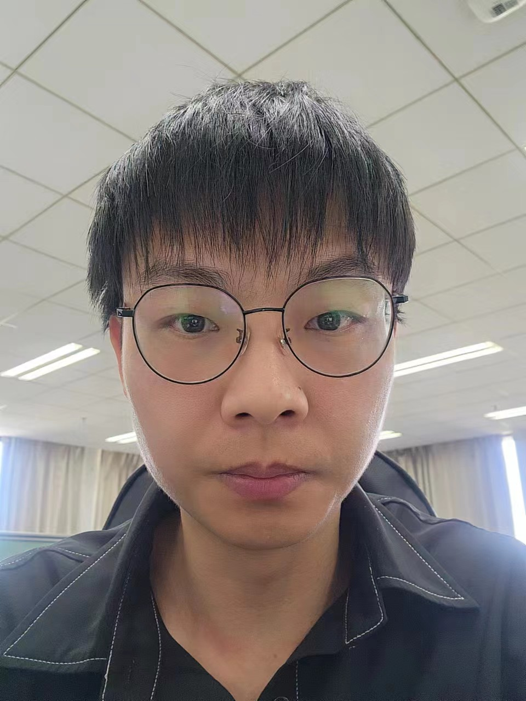

# 刘小亮（Xiaoliang Liu）

## [Main](https://abeliuxl.github.io) | [Adversarial Attack](https://docs.qq.com/doc/p/574325869aa45ac6bbe9dc1f5b49e9630a873435) | [Adversarial Robustness](https://docs.qq.com/doc/p/a3fa47e29419471627ef8e4b5385a322fee84f42)

[中文](https://abeliuxl.github.io/index_cn.html) | [English](https://abeliuxl.github.io)

## Xiaoliang Liu

**Email: 20249197@wzbc.edu.cn**

**Homepage: [abeliuxl.github.io](https://abeliuxl.github.io)**

[comment]: <> ([Department of Computer Science and Technology, Nanjing University]&#40;https://cs.nju.edu.cn/main.htm&#41; | [National Key Laboratory for Novel Software Technology]&#40;https://keysoftlab.nju.edu.cn/main.htm&#41; | [Robotics Intelligence and Neural Computing &#40;RINC&#41; Research Group]&#40;https://cs.nju.edu.cn/rinc/index.html&#41;)
 [School of Information Engineering, Wenzhou Business College](https://zsw.wzbc.edu.cn/Col/Col855/Index.aspx)  | [Robotics Intelligence and Neural Computing (RINC) Research Group, Nanjing University](https://cs.nju.edu.cn/rinc/index.html) 

## Latest Updates
- 2024-08-20: "RADAP: A Robust and Adaptive Defense Against Diverse Adversarial Patches on Face Recognition" accepted by *Pattern Recognition*.
- 2024-06-20: Successfully graduated with a PhD.
- 2024-05-23: Successfully passed the PhD dissertation defense.
- 2024-03-31: Updated the paper link.

---

## Education

- **2018.09 - 2024.06**: Nanjing University, Ph.D. in Computer Science and Technology, Member of RINC Group, Supervisor: Prof. Furao Shen
- **2016.09 - 2018.07**: Nanjing University, M.S. in Computer Science and Technology, Member of RINC Group, Supervisor: Prof. Furao Shen
- **2009.09 - 2014.07**: Fujian University of Technology, B.S. in Communication Engineering

---

## Research Interests

- AI (Neural Network) Security
- Adversarial Learning
- Computer Vision
- Deep Neural Networks

---

## Research Achievements

### Published Papers:

1. **Xiaoliang Liu**, Furao Shen, Jian Zhao and Changhai Nie. AugRmixAT: A data processing and training method for improving multiple robustness and generalization performance [C]. IEEE International Conference on Multimedia and Expo (ICME). 2022: 1-6. [Paper](https://ieeexplore.ieee.org/document/9859665) (CCF-B, EI)
2. **Xiaoliang Liu**, Furao Shen, Jian Zhao and Changhai Nie. Self-supervised learning of monocular 3D geometry understanding with two-and three-view geometric constraints [J]. The Visual Computer, 2024, 40(2): 1193-1204. [Paper](https://link.springer.com/article/10.1007/s00371-023-02840-y) (CCF-C, SCI, JCR-Q2)
3. **Xiaoliang Liu**, Furao Shen, Jian Zhao and Changhai Nie. EAP: An effective black-box impersonation adversarial patch attack method on face recognition in the physical world [J]. Neurocomputing, 2024: 127517. [Paper](https://www.sciencedirect.com/science/article/abs/pii/S0925231224002881) (CCF-C, SCI, JCR-Q2)
4. **Xiaoliang Liu**, Furao Shen, Jian Zhao and Changhai Nie. RandoMix: a mixed sample data augmentation method with multiple mixed modes [J]. Multimedia Tools and Applications, 2024: 1-17. [Paper](https://link.springer.com/article/10.1007/s11042-024-18868-8) (CCF-C, SCI, JCR-Q2)
5. **Xiaoliang Liu**, Furao Shen, Jian Zhao, Changhai Nie. "RADAP: A Robust and Adaptive Defense Against Diverse Adversarial Patches on Face Recognition." Pattern Recognition (2024): 110915. [<a href="https://arxiv.org/abs/2311.17339" target="_blank" style="color:rgb(0, 110, 175);">Paper</a>] (CCF-B，SCI，JCR-Q1)
### Submitted Papers:

1. **Xiaoliang Liu**, Furao Shen, Feng Han, Jian Zhao and Changhai Nie. NeRFTAP: Enhancing transferability of adversarial patches on face recognition using neural radiance fields [J]. arXiv preprint arXiv:2311.17332, 2023. [Paper](https://arxiv.org/abs/2311.17332) (CCF-B, SCI, Under Review)

### Patents:

1. Furao Shen, Kepan Gao, **Xiaoliang Liu**, et al. A method for indoor localization by fusing UWB and LiDAR: 202011520518 [P] [2024-02-28].

### Book Chapters:

1. Furao Shen. Self-Organizing Incremental Learning Neural Networks [M]. Electronic Industry Press, September 2023. (Chapter 1: Mathematical Foundations)

---

## Awards

- 2022.08 - 2023.03: The First Greater Bay Area (Huangpu) International Algorithm Competition, Adversarial Robustness Defense Algorithm for Deep Learning Models, Finalist Prize. (Individual Participation)

---

## Research Projects

- State Grid Corporation of China Headquarters Science and Technology Project, Research and Application of Substation HD Video and Robot Joint Inspection Technology Based on Multi-Dimensional Image Intelligent Matching and Recognition, Project Number: 520950200009. (Participant)
- Ministry of Science and Technology Major Project - the STI 2030-Major Projects of China, Efficient Learning Mechanism of Spiking Networks Based on Neural Plasticity and Brain-Inspired Intelligence System, Grant Nos: 2021ZD0201300. (Participant)
- National Natural Science Foundation of China General Program, Research on Novel Neural Networks for Incremental Unsupervised Learning, Grant Nos: 62276127. (Participant)

---

## Research Services

- IEEE Transactions on Circuits and Systems for Video Technology (TCSVT, Peer Reviewer)

---

## Other Information

- Email: 20249197@wzbc.edu.cn
- Address:   
- ORCiD:  [https://orcid.org/0000-0002-3776-6929](https://orcid.org/0000-0002-3776-6929)
- Web of Science: [KFQ-9516-2024](https://www.webofscience.com/wos/author/record/KFQ-9516-2024)
- Google Scholar: [Xiaoliang Liu](https://scholar.google.com/citations?hl=zh-CN&user=Eg6rWc8AAAAJ)

---

---

<footer style="text-align: center;">

Copyright &copy; 2023-2024 Xiaoliang Liu

</footer>